# AGENTIC DEVELOPMENT IN PRACTICE

---

# ABOUT ME

- Experimentator by heart.
- Keeping my personal home laboratory.
- Building the TORQ AI project.

---

# WHY AGENTIC DEVELOPMENT MATTERS NOW

- **AI:** Models can act, inspect, and iterate autonomously.
- **Scaling:** Systems become too complex for human oversight.
- **Velocity:** Fast and reliable dev cycles.
- **Quality:** Enforcement of patterns and standards.

---

# TOOLING

Each tool offers different approaches to AI-assisted development with varying levels of autonomy and integration.

- CodeMie
- Cursor
- GitHub Copilot

---

# ABOUT TORQ

- Turns Strava activities into art.
- No manual prompts anymore!
- Makes better visual feedback from the Strava tape.

---

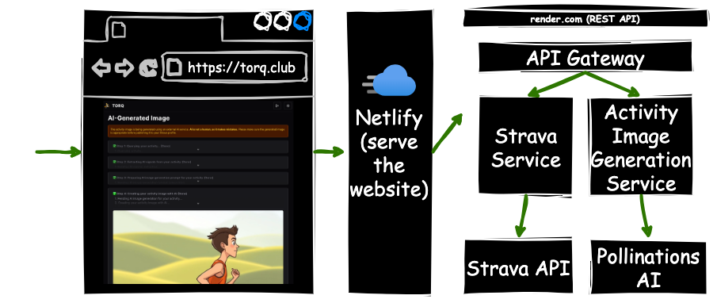

---

# LET'S TRY IT!

[https://torq.club](https://torq.club)

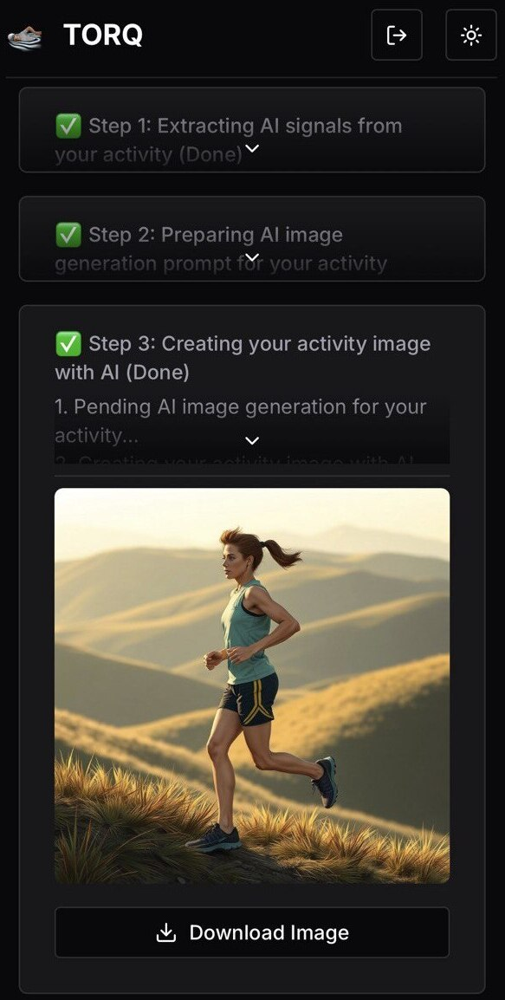

---

# AI 101

---

# CONTEXT = MEMORY

- **Input context:** Everything the model can see and reference.
- **Working memory:** Current conversation and file contents.
- **Limitations:** Token limits and attention mechanisms.
- **Strategy:** Carefully curate what context gets included.

---

# SYSTEM PROMPT = POLICY LAYER

- **Behaviors:** How the agent should operate.
- **Guardrails:** What the agent should and shouldn't do.
- **Personality:** Tone, style, and approach preferences.

---

# PROMPT = RUNTIME CONFIGURATION

- **Instructions:** How you want the model to behave.
- **Task:** What exactly needs to be accomplished.
- **Constraints:** Boundaries and requirements for the output.
- **Examples:** Templates and patterns.

---

# TOOL = FUNCTION CALLING

- **Actions:** Predefined functions the model can invoke.
- **Effects:** File operations, API calls, system commands...
- **Results:** Tool call outputs.

---

# MODELS ARE STATELESS

- **No persistence:** Each interaction starts fresh.
- **Context-dependent:** Behavior is based on the context.
- **Reproducible:** Same inputs produce similar outputs.
- **Orchestration:** External systems manage state and continuity.

---

# AGENTIC DEVELOPMENT 101

---

# CODE EDITOR INLINE SUGGESTIONS

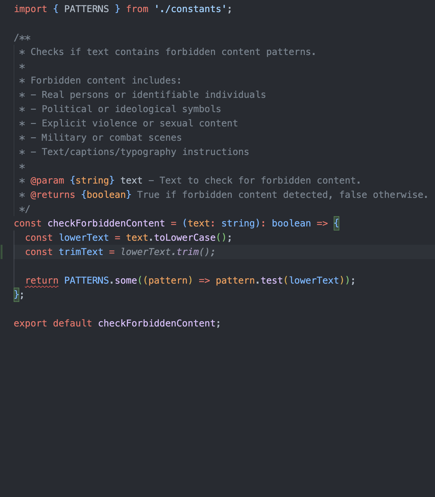

- **Autocomplete++:** Context-aware code completion.
- **Single-line focus:** Predict what you're about to type.
- **Limited scope:** Works within current file.

---

# FILE-SCOPED REASONING

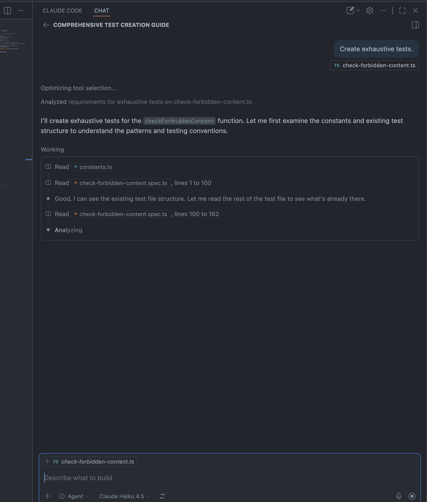

- **File-level:** Comprehend file structure and purpose.
- **Context-aware:** Consider relationships between code blocks and files.
- **Interactive:** Back-and-forth conversation.

---

# ORCHESTRATED AGENT

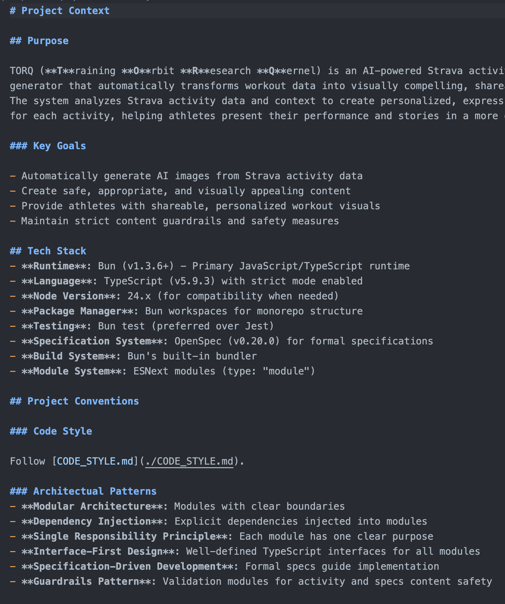

- **Structured:** [`AGENTS.md`](https://agents.md/).
- **Skills:** Composable behaviors.
- **Hooks:** Automated responses.
- **Systematic:** Consistent patterns.

---

# AGENTIC DEVELOPMENT SCHOOLS

---

# VIBE-CODING

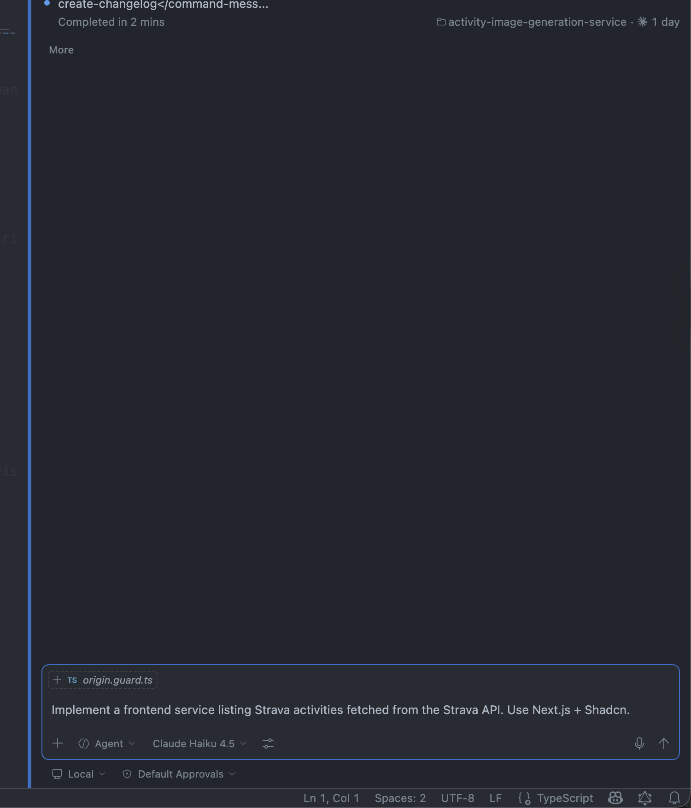

- **Intuitive:** Based on feel.
- **No planning:** Agent guides the architecture.
- **Rapid:** Fast feedback loops.
- **Trade-offs:**
  - Speed vs. structure.
  - Flexibility vs. consistency.

---

# SPEC-DRIVEN DEVELOPMENT

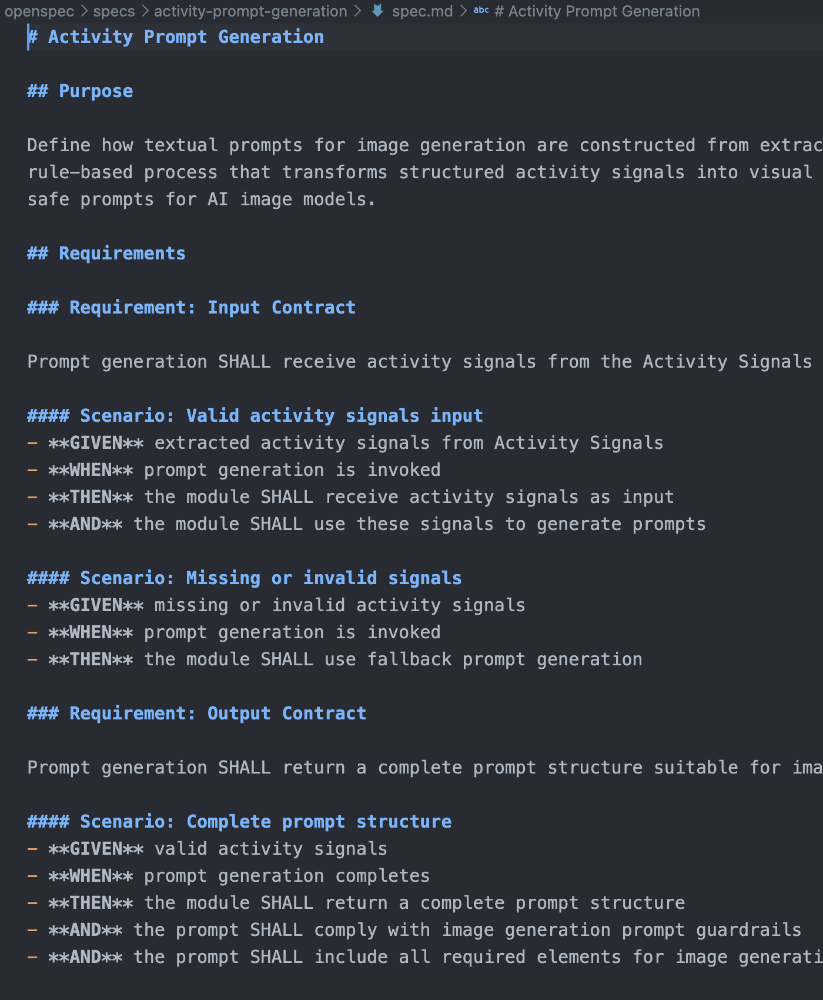

- **Doc:** Specification before implementation.
- **Contracts:** Upfront behaviors.
- **Systematic:** Structured planning.
- **Predictable:** Reduced surprises.

---

# SKILLS & HOOKS

---

# SKILLS: REUSABLE STRUCTURED CAPABILITIES

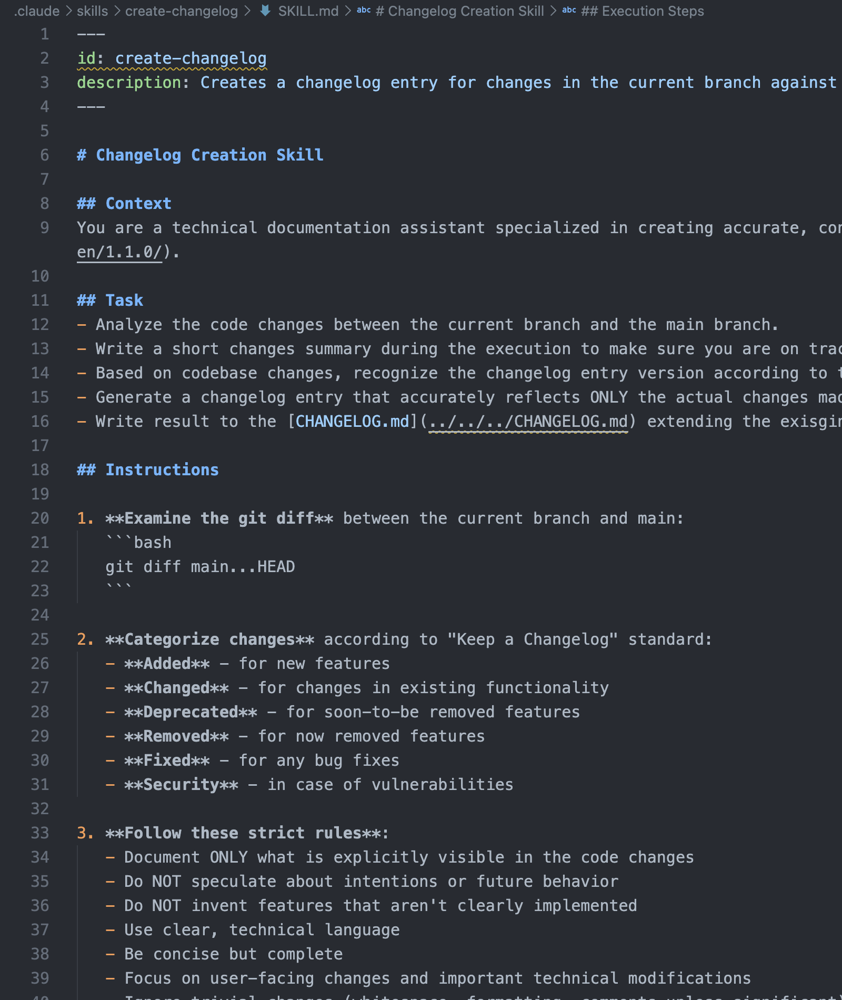

- **Standard:** Predictable actions for common tasks ("Update changelog").
- **APIs:** Act like function calls for the agent.
- **Knowledge:** Capture best practices in reusable form.

---

# [SKILLS.SH](https://skills.sh)

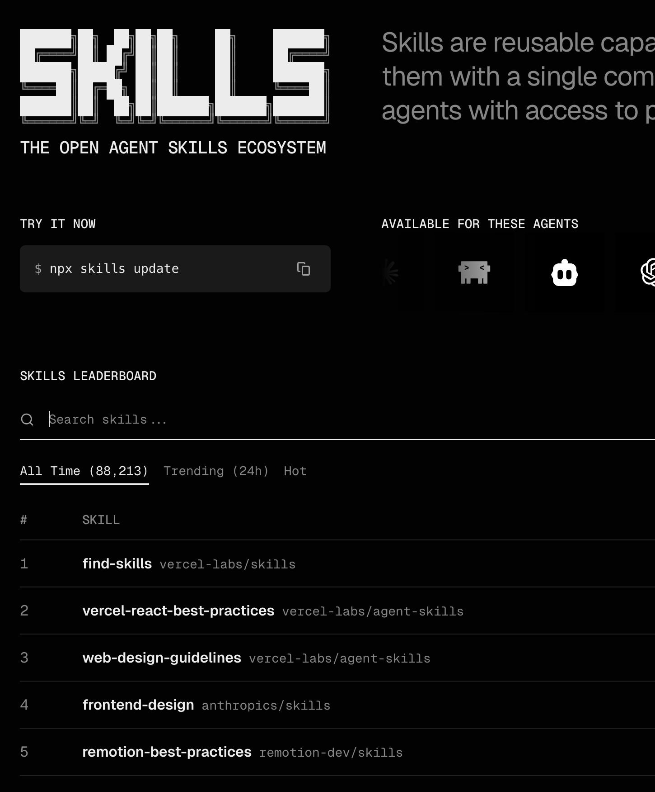

The easiest way to start with skills is to use shared ones!

---

# HOOKS: EVENT-DRIVEN TRIGGERS

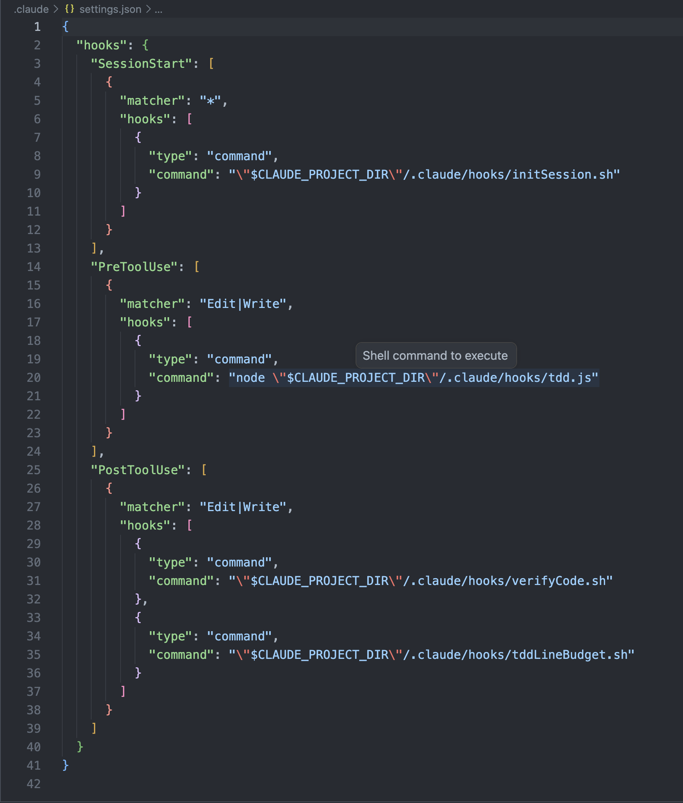

- **Automated:** React to system actions.
- **Feedback:** Continuous monitoring.
- **Guardrails:** Prevent common mistakes early.

---

# [AI Templates](https://www.aitmpl.com/)

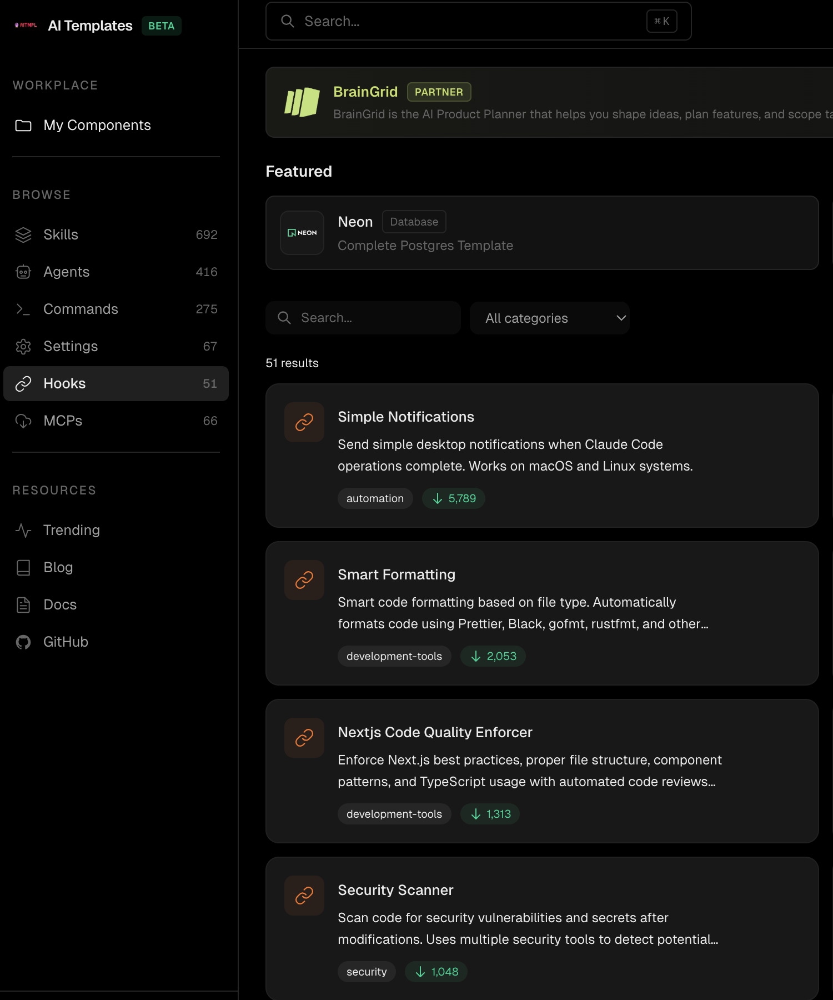

The easiest way to start with hooks is to use shared ones!

---

# EXAMPLE: TDD

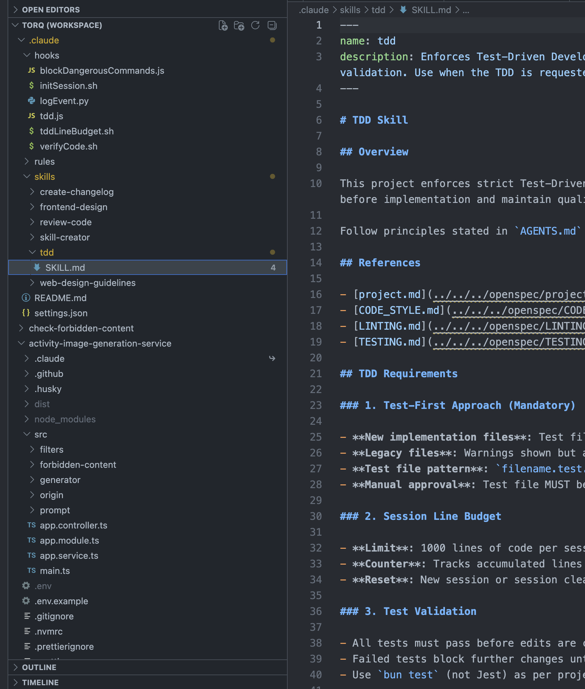

Test-Driven Development is all about implementing tests before the logic.

---

# PRACTICAL THINGS

- **Plan with heavy model, implement with simple one:** Use powerful models (GPT-4, Claude) for architecture and planning, lighter models for implementation
- **Divide and conquer:** Break complex tasks into smaller, focused contexts with clear boundaries

---

# THE END

> The real shift is not AI writing code.
> It's engineers designing systems that include AI as an actor.

---

# QUESTIONS TIME!
