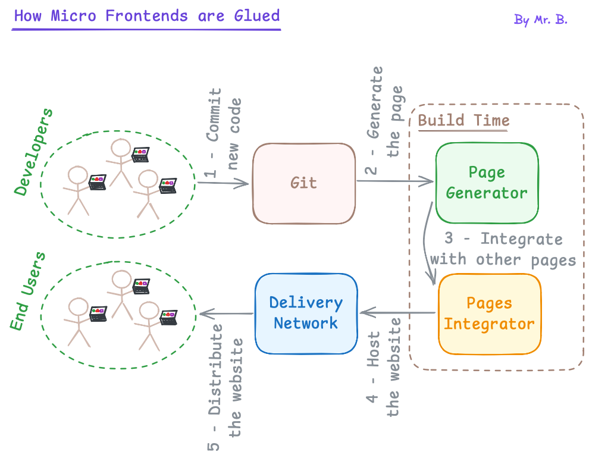

# COMPOSABLE FRONTEND

In detail.

According to the [Composable Frontend Explained: How to Build a Future-Proof UI Architecture](https://balov.dev/blog/composable-frontend-explained-how-to-build-a-future-proof-ui-architecture/) by [Mr.B](https://balov.dev/).

---

# GLOSSARY

- **CF:** Composable Frontend.
- **DDD:** Domain-Driven Design. [↗](https://martinfowler.com/bliki/DomainDrivenDesign.html)

---

# TL;DR

- CF enables high flexibility.
- CF promotes building GUI from building blocks, like Lego.
- CF is complex and expensive.
- With DDD, a better flexibility (and even higher complexity) becomes possible.

---

# KEY TOPICS

- Micro Frontends
- Jamstack
- Atomic Deploys
- Headless Software
- SSR, SSG, ISR
- MACH
- Brick

---

# MICRO FRONTENDS

- Enable even more flexibility.
- Add an additional complexity.
- Align well with DDD. [↗](https://balov.dev/blog/composable-frontend-explained-how-to-build-a-future-proof-ui-architecture/#the-power-of-domain-oriented-teams)
- Allow to mix techs.

---

---

---

# JAMSTACK

- JS, APIs, Markup.
- Decouples UI from business logic.
- SSG, Atomic Deploys, Headless.

TODO generate image

# ATOMIC DEPLOYS

- todo
