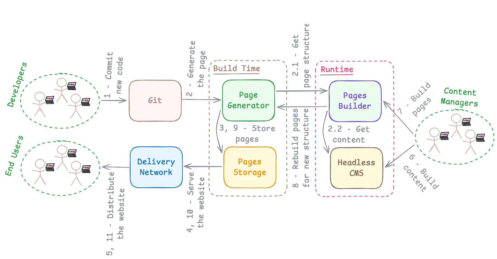

# COMPOSABLE FRONTEND

Intro.

According to the [Composable Frontend Explained: How to Build a Future-Proof UI Architecture](https://balov.dev/blog/composable-frontend-explained-how-to-build-a-future-proof-ui-architecture/) by [Mr.B](https://balov.dev/).

---

# 1. GLOSSARY

- **CF:** Composable Frontend.
- **MFE:** Micro Frontend.
- **DDD:** Domain-Driven Design. [↗](https://martinfowler.com/bliki/DomainDrivenDesign.html)
- **LAMP:** Linux, Apache, MySQL, PHP. [↗](https://www.atlassian.com/blog/bitbucket/lamp-vs-mean-which-stack-is-right-for-you)
- **SSR:** Server-Side Rendering.
- **SSG:** Static Site Generation. [↗](https://balov.dev/blog/composable-frontend-explained-how-to-build-a-future-proof-ui-architecture/#static-site-generation)
- **ISR:** Incremental Static Regeneration.
- **DPR:** Distributed Persistent Rendering.

---

# 2. WHAT IS CF?

And how to benefit from it in practice?

---

##### 2.1. BREAK DOWN UI INTO INDEPENDENT PIECES

Instead of building one big FE, you split your UI into smaller, independent components that can be developed, tested, and updated separately.

---

##### 2.2. REUSE & COMBINE

Building blocks can be reused or combined in different ways to create flexible and dynamic user interfaces.

---

##### 2.3. TEAM-FRIENDLY APPROACH

Different teams can work on different parts of the FE (like the header, footer, or search bar) without stepping on each other's toes, speeding up development. Aligns well with DDD and Modular Monolith.

---

##### 2.4. FUTURE-PROOF ARCHITECTURE

Since components are decoupled, it's easier to update, replace, or add new features without reworking the entire FE.

---

# 3. KEY TOPICS

- Micro Frontends
- Brick
- Jamstack
- Atomic Deploys
- Headless Software
- SSR, SSG, ISR
- MACH Alliance

---

# 4. MICRO FRONTENDS

- Enable even more flexibility.
- Add an additional complexity.
- Align well with DDD. [↗](https://balov.dev/blog/composable-frontend-explained-how-to-build-a-future-proof-ui-architecture/#the-power-of-domain-oriented-teams)
- Allow to mix techs.

---

# 5. BRICK

- It is a conceptual thing.
- Imagine it as a reusable UI element that is isolated from other functionality.
- The term is based on the Lego example, that gives you enough flexibility to build literally anything from elements with a universal interface (i.e., bricks).

---

##### 5.1. HOW MFEs ARE GLUED

---

##### 5.2. HOW CF BRICKS ARE GLUED

---

# 6. JAMSTACK

- JS, APIs, Markup.
- Decouples UI from business logic. [↗](https://daverupert.com/2024/02/ui-states/)
- SSG, Atomic Deploys, Headless.

---

# 7. ATOMIC DEPLOYS [↗](https://balov.dev/blog/composable-frontend-explained-how-to-build-a-future-proof-ui-architecture/#atomic-deploys)

- Zero-downtime releases.
- Immutable and self-contained builds.
- Resemble the blue-green deployment.
- Allow quick experiments.
- Work well with Trunk Based Development.

---

# 8. HEADLESS SOFTWARE [↗](https://balov.dev/blog/composable-frontend-explained-how-to-build-a-future-proof-ui-architecture/#headless-data-providers)

- No GUI.
- Only data is important.
- Example: Headless CMS. [↗](https://jamstack.org/headless-cms/)
- Counter example: LAMP Stack. [↗](https://www.atlassian.com/blog/bitbucket/lamp-vs-mean-which-stack-is-right-for-you)

---

##### 8.1. HEADLESS CMS

---

# 9. SSR, SSG, ISR [↗](https://balov.dev/blog/composable-frontend-explained-how-to-build-a-future-proof-ui-architecture/#static-site-generation)

- **SSR:** The page is generated for every request.
- **SSG:** The page is generated in advance, during the build time.
- **ISR:** The page is generated during the build-time, but on-demand. Next.js' feature.
- **DPR:** The same as ISR, but more generic. Invented by Netlify.

---

# 10. MACH ALLIANCE [↗](https://en.wikipedia.org/wiki/MACH_Alliance)

Non-profit (🤨) group of software vendors which promote the following principles in the software development:

- Microservices
- API-First
- Cloud-Native
- Headless

---

# SUMMARY

- CF enables high flexibility.
- CF promotes building GUI from building blocks, like Lego.
- CF is complex and expensive.
- With DDD, a better flexibility (and even higher complexity) becomes possible.
- Read my article for more details! [↗](https://balov.dev/blog/composable-frontend-explained-how-to-build-a-future-proof-ui-architecture/)

---

# THE END!

Your questions are welcome. [↗](./questions-1)
