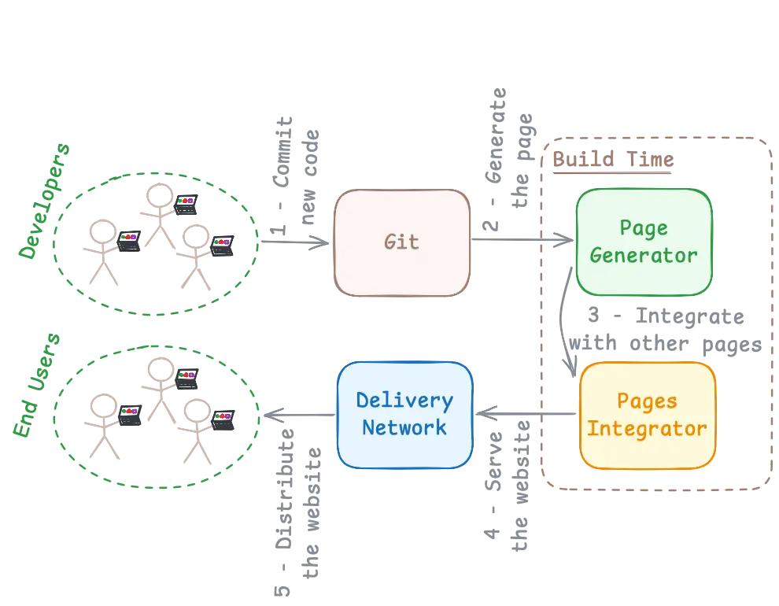
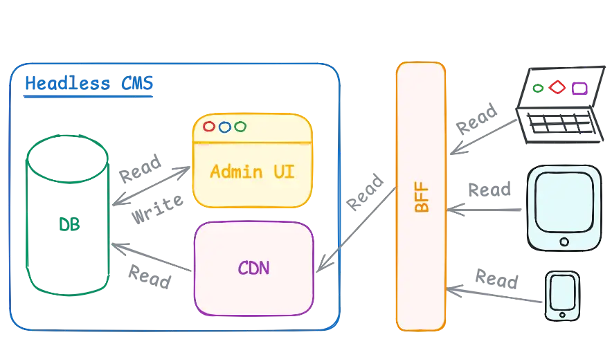

# COMPOSABLE FRONTEND

Intro.

According to the [Composable Frontend Explained: How to Build a Future-Proof UI Architecture](https://balov.dev/blog/composable-frontend-explained-how-to-build-a-future-proof-ui-architecture/) by [Mr.B](https://balov.dev/).

---

# GLOSSARY

- **CF:** Composable Frontend.
- **DDD:** Domain-Driven Design. [↗](https://martinfowler.com/bliki/DomainDrivenDesign.html)
- **LAMP:** Linux, Apache, MySQL, PHP. [↗](https://www.atlassian.com/blog/bitbucket/lamp-vs-mean-which-stack-is-right-for-you)
- **SSR:** Server-Side Rendering.
- **SSG:** Static Site Generation. [↗](https://balov.dev/blog/composable-frontend-explained-how-to-build-a-future-proof-ui-architecture/#static-site-generation)
- **ISR:** Incremental Static Regeneration.
- **DPR:** Distributed Persistent Rendering.

---

# TL;DR

- CF enables high flexibility.
- CF promotes building GUI from building blocks, like Lego.
- CF is complex and expensive.
- With DDD, a better flexibility (and even higher complexity) becomes possible.

---

# KEY TOPICS

- Micro Frontends
- Jamstack
- Atomic Deploys
- Headless Software
- SSR, SSG, ISR
- MACH Alliance
- Brick

---

# MICRO FRONTENDS

- Enable even more flexibility.
- Add an additional complexity.
- Align well with DDD. [↗](https://balov.dev/blog/composable-frontend-explained-how-to-build-a-future-proof-ui-architecture/#the-power-of-domain-oriented-teams)
- Allow to mix techs.

---

---

---

# JAMSTACK

- JS, APIs, Markup.
- Decouples UI from business logic.
- SSG, Atomic Deploys, Headless.

---

# ATOMIC DEPLOYS [↗](https://balov.dev/blog/composable-frontend-explained-how-to-build-a-future-proof-ui-architecture/#atomic-deploys)

- Zero-downtime releases.
- Immutable and self-contained builds.
- Resemble the blue-green deployment.
- Allow quick experiments.
- Work well with Trunk Based Development.

---

# HEADLESS SOFTWARE [↗](https://balov.dev/blog/composable-frontend-explained-how-to-build-a-future-proof-ui-architecture/#headless-data-providers)

- No GUI.
- Only data is important.
- Example: Headless CMS. [↗](https://jamstack.org/headless-cms/)
- Counter example: LAMP Stack. [↗](https://www.atlassian.com/blog/bitbucket/lamp-vs-mean-which-stack-is-right-for-you)

---

---

# SSR, SSG, ISR [↗](https://balov.dev/blog/composable-frontend-explained-how-to-build-a-future-proof-ui-architecture/#static-site-generation)

- **SSR:** The page is generated for every request.
- **SSG:** The page is generated in advance, during the build time.
- **ISR:** The page is generated during the build-time, but on-demand. Next.js' feature.
- **DPR:** The same as ISR, but more generic. Invented by Netlify.

---

# MACH ALLIANCE [↗](https://en.wikipedia.org/wiki/MACH_Alliance)

Non-profit (🤨) group of software vendors which promote the following principles in the software development:

- Microservices
- API-First
- Cloud-Native
- Headless

---

# BRICK

- It is a conceptual thing.
- Imagine it as a reusable UI element that is isolated from other functionality.
- The term is based on the Lego example, that gives you enough flexibility to build literally anything from elements with a universal interface (i.e., bricks).

---

# THE END!

